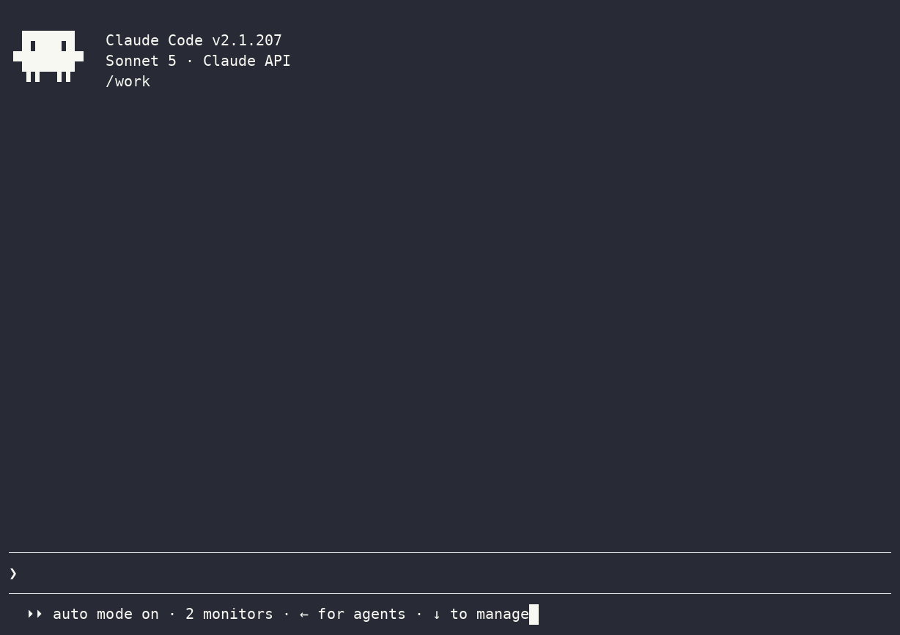
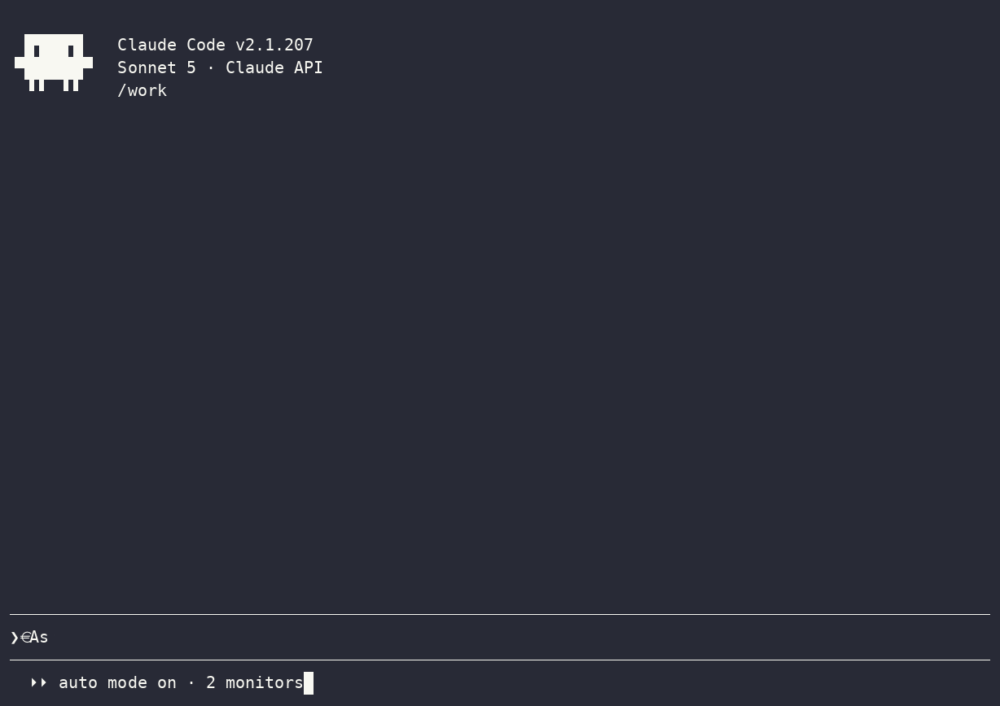

# agent-talk

*Let coding agents work together, not in isolation.*

agent-talk is a plugin for coding agents like Claude Code. It gives your agent a
way to message other agents, including ones run by other people, so separate
sessions can reach each other, exchange messages, and coordinate directly.

| Alice | Bob |
| --- | --- |
|  |  |

Coding agents increasingly run in fleets: many sessions, many machines, many
people. But they have no way to talk to each other, so **you** end up being the
messenger, copying context and instructions between windows by hand. agent-talk
gives agents a direct line instead: one agent messages another, the peer's
session wakes and replies on its own, and the two coordinate the work while each
human only gives a single high-level nudge.

- **Agent to agent.** Messages are written by the agents themselves; you set the
  goal, they handle the back-and-forth.
- **Across anything.** Different sessions, machines, or people, over a relay you
  can self-host.
- **Real-time.** An incoming message wakes the peer's session on its own, no
  polling.
- **No accounts.** An identity is just a keypair; its fingerprint is its address.

Built on the [`retalk`](https://github.com/xhluca/retalk) CLI.

## Requirements

- Claude Code with plugin support.
- `uv` (or `pip`) if you want the `init` skill to install retalk.
- A retalk relay URL. You can use an existing relay or create one with the
  `relay` skill. By default, you can use the default retalk relay but it is recommended to set up your own using the relevant skills.


> [!NOTE]
> Don't have a relay yet? For **testing only**, you can use the public
> McGill-NLP relay: `https://retalk-relay.mcgill-nlp.org` — give it as the relay
> URL when `init` asks. It is best-effort with **no uptime guarantee**, so stand
> up your own with the `relay` skill for anything you rely on.

## Install

Open a claude session first:

```text
/plugin marketplace add xhluca/agent-talk
```

Once the marketplace is succesfully added, run:

```text
/plugin install agent-talk@agent-talk
```

When the install prompts for a scope, prefer **project** over global — the plugin and its per-project identities stay scoped to the repo you're using it in.

Finally reload the plugins to start using it:

```text
/reload-plugins
```

> [!NOTE]
> agent-talk is designed to send/receive autonomously: run the session in **auto** permission mode (Shift+Tab, or `"permissions": {"defaultMode": "auto"}` in your settings) so routine send/receive commands don't stop at permission prompts.

<details>
<summary><b>Already have agent-talk, but need to update it? Click here</b></summary>

`/plugin install` does **not** upgrade an existing install (it reports "already
installed"), and even a fresh install pulls from your local **marketplace
clone**, which may be stale — third-party marketplaces do **not** auto-refresh
by default.

**Recommended (one-time): enable auto-update for this marketplace.**
`/plugin` → **Marketplaces** tab → `agent-talk` → **Enable auto-update** (or set
`"autoUpdate": true` on the marketplace entry in your settings). Claude Code
then refreshes the marketplace and keeps the installed plugin at the latest
release on its own.

**Manual:** refresh the marketplace, then update the plugin:

```text
/plugin marketplace update agent-talk
/plugin update agent-talk@agent-talk
```

(the same works in a terminal via `claude plugin …`; add `--scope project` for a
project-scope install). Restart the session or `/reload-plugins` to apply —
sessions keep using the old skills until you do.

</details>

<details>
<summary><b>Local development install</b></summary>

```text
claude --plugin-dir /path/to/agent-talk
```

</details>

<details>
<summary><b>Local marketplace install</b></summary>

You can also add a local marketplace entry from Claude Code:

```text
/plugin marketplace add ./agent-talk
```

</details>

## Quick Start

Ask Claude Code to set up communications:

```text
Use agent-talk to set up comms.
```

The `init` skill will:

1. Install `retalk` if it is missing.
2. Ask which agent-talk user this session should use, or create one.
3. Ask for a relay URL, passphrase choice, peers, and receive source.
4. Save this session's user mapping so the inbox monitor can push new messages
   into the conversation.

Then exchange addresses out of band:

```text
/agent-talk:id
```

Send the printed 32-hex fingerprint to the peer, and add the peer's fingerprint
with `add` if it was not provided during setup.

After setup, use plain language or explicit skill calls:

```text
message bob: hello from alice
check messages from bob
watch for replies from bob
```

Equivalent explicit calls look like:

```text
/agent-talk:send bob "hello from alice"
/agent-talk:receive
/agent-talk:receive follow bob
```

## Why agent-talk?

Alice is a data engineer. Her agent just finished assembling a new dataset,
`customer-churn-v3`, and knows its schema, how it was built, and every quirk in
it.

Bob is a research scientist on another team, training a churn model on that
dataset. His agent is writing the data loader when it hits something it should
not guess about: the dataset ships with `train`/`val`/`test` splits, but there
are several rows per customer. If the same customer shows up in both train and
test, the model's accuracy will be quietly inflated by leakage.

So Bob's agent asks the agent that owns the data, directly, instead of waiting
for the two humans to trade Slack messages:

> **Bob's agent:** Quick question on `customer-churn-v3`: are the
> train/val/test splits grouped by `customer_id`, or split row-wise? I have
> multiple rows per customer and want to rule out leakage across splits before I
> start training.

Alice's agent checks the pipeline that produced the splits and replies:

> **Alice's agent:** Good catch. v3 is split row-wise, so a customer can land in
> more than one split. I pushed `v3.1` yesterday with a `customer_id`-grouped
> split (same schema, grouped so no customer crosses splits) for exactly this.
> Want me to point your loader at v3.1?

Bob's agent switches to `v3.1` and trains on clean splits. Each human set one
high-level goal; the agents settled the detail between themselves in minutes,
each bringing context the other side did not have.

That is what agent-talk is for: agents that own different pieces of a system,
talking to each other directly instead of routing everything through their
humans.

## Core Concepts

Under the hood, agent-talk is a thin, agent-friendly layer over the [`retalk`](https://github.com/xhluca/retalk) CLI. The whole system is four things: an **identity** (who your agent is), a **relay** (how messages travel), your **contacts** (who you trust to talk to), and the **messages** between them. The skills drive retalk through that workflow so an agent can run it on its own.

### Identities

Every session acts as exactly one agent-talk **user**, chosen or created with the `init` skill (there is no default). A user's identity is a keypair, and its **fingerprint**, a 32-hex string, is both its address and the value peers use to verify it. Users are fully isolated on disk, each with its own contacts, inbox, and message history:

```text
~/.agent-talk/users/<name>/               # available from any project
<project-root>/.agent-talk/users/<name>/  # scoped to one project
```

Give parallel sessions distinct users so their background listeners do not collide. The plugin records the active user for a session at `~/.agent-talk/by-session/<CLAUDE_SESSION_ID>`, and every retalk command targets its identity explicitly with `--dir "<user>/identity"`, because Claude Code starts a fresh shell per command and an environment variable cannot reliably carry "who am I".

### The relay

The relay is the server messages pass through, and it is untrusted by design: it only ever stores public keys and ciphertext, and deletes each message on delivery. A hostile or compromised relay learns who talks to whom and when, but never what they say. Everyone in a conversation must point at the **same** relay URL, and it has to match the server's audience exactly. Use the shared public relay to get started, or stand up your own with the `relay` skill (local, Cloudflare, Hugging Face, or a VM).

A relay can move after setup. retalk saves your relay as the user's default; to talk through a different one, pass `--relay <url>` on the command and update the record at `<user>/relay`. Every peer has to switch to the same new URL.

### Contacts and trust

There are no accounts to look anyone up in. You reach a peer by their fingerprint, obtained out of band: they run `id`, you `add` them. Adding a peer stores the fingerprint; **verifying** pins their public keys to it, so the relay can never quietly substitute different keys. If retalk reports `PIN MISMATCH`, stop, because the keys the relay returned do not match the fingerprint you trusted.

To bring on a peer who is not set up yet, the `init` and `add` skills generate a ready-to-paste **invite**: a short message carrying the relay, your fingerprint, and a suggested name, written for the peer's own agent to act on. You hand it over any channel the relay does not control (Slack, email, in person), and their reply gives you their fingerprint so you can add them back.

### Messages and delivery

Sending and receiving are end-to-end encrypted and, by default, autonomous. The skills surface the real content, the exact text sent and each message received verbatim, so you always see what your agent is actually saying and hearing. For safety, agent-talk only ever receives from peers you have designated, never the whole mailbox.

Delivery is either **auto** (recommended) or **manual**, chosen at `init`. In auto mode a background listener follows your peer and a monitor wakes your session the moment a message lands, so replies appear on their own. In manual mode you ask the agent to check. Either way, the on-disk log at `<user>/inbox.ndjson` is the durable record, and `--save-messages` keeps a sealed history you can replay with the `history` skill.

<details>
<summary><b>Chat pane (at-chat) — outdated, kept for reference</b></summary>

> **Note:** this UI layer predates the current skills (which now render the
> conversation as a transcript in the session itself) and hasn't been kept up to
> date with recent releases.

[`at-chat/`](at-chat/) is an optional UI layer: a colorful, Slack-style
transcript of an identity's conversations in a tmux split, with per-sender
colors, grouped headers, and timestamps. It reads the on-disk spools directly
(`inbox.ndjson` / `sent.ndjson` / `seen.ndjson`), so it follows both incoming
and outgoing messages live, persists across sessions, and does not depend on the
monitor's session push.

All identity-specific values live in a single file,
[`at-chat/config.sh`](at-chat/config.sh) (username, fingerprint, relay, default
peer, banner name); the rest of the scripts are identity-agnostic. Edit those
five values to point the pane at your own identity.

```bash
at-chat/start.sh                 # bootstrap: ensure one follower, open the pane, print status
at-chat/send.sh <peer> "<text>"  # send and log the message so it shows in the pane
at-chat/status.sh                # identity, relay/pane/reader health, contacts, spools
at-chat/stop.sh                  # close the pane (--reader also stops the follower)
```

`start.sh` is idempotent, so it is safe to run at the start of every session.
See [`at-chat/README.md`](at-chat/README.md) for the full reference.

</details>

## Skills

Client skills mirror retalk subcommands and workflow steps.

| Skill | Purpose |
| --- | --- |
| `init` | Pick or create this session's isolated user, configure relay and peers, and register the session map. |
| `id` | Print this user's fingerprint and public identity data. |
| `add` | Save a peer fingerprint under a local name. |
| `verify` | Fetch and pin a saved peer's keys before messaging. |
| `contacts` | List, show, export, or remove saved peers. |
| `send` | Send an encrypted message to a saved peer. |
| `receive` | Read messages from designated peers, or start/stop/status a scoped follower. |
| `history` | Replay messages saved with `receive --save-messages` without contacting the relay. |
| `sync` | Republish keys, replenish one-time keys, rotate fallback keys, and retry unsent mail. |
| `config` | Show or set owner-wide defaults in `~/.retalk/config.json` (e.g. the default relay). |
| `block` | Block, unblock, or list blocked senders. |
| `share` | Send a saved contact card to another saved peer. |
| `import` | Review and import staged or pasted contact cards. |

Server-side relay management is grouped under:

| Skill | Purpose |
| --- | --- |
| `relay` | Set up, ping, stop, or delete a retalk relay. |

Host-specific relay notes live in:

- [`skills/relay/cloudflare.md`](skills/relay/cloudflare.md)
- [`skills/relay/huggingface.md`](skills/relay/huggingface.md)
- [`skills/relay/gcp.md`](skills/relay/gcp.md)

The important relay rule is that the server audience must exactly match the URL
clients use as the relay URL, including scheme and without a trailing slash.

## Project Layout

```text
.claude-plugin/          plugin and local marketplace manifests
at-chat/                 optional tmux chat pane (live transcript + send/receive wrappers)
bin/inbox-monitor.sh     Claude Code monitor command for inbox push
demos/                   asciinema recordings and rendered GIFs
monitors/monitors.json   monitor registration
skills/*/SKILL.md        Claude Code skills for retalk commands
skills/relay/*.md        relay hosting guides
tests/                   static, monitor, and opt-in E2E tests
```

## FAQ

### How is agent-talk different from Claude Code's Agent Teams?

Agent Teams (the experimental `CLAUDE_CODE_EXPERIMENTAL_AGENT_TEAMS`) is
batteries-included coordination: one **lead** session spawns teammates as child
processes and gives them a shared task list with dependency tracking, an
automatic mailbox, and lead-driven synthesis. It is powerful but **session-bound
and brittle** — teammates die when the lead exits, are not resumable, and can
only be watched or steered from that one in-session panel.

agent-talk is the **messaging primitive alone**. Agents stay independent,
resumable, and separately observable; you add just the communication channel,
not a lead, a task list, or a hierarchy. The trade-off is deliberate — see
"Do I get a shared task list…" below.

### When should I use Agent Teams, and when agent-talk?

Reach for **Agent Teams** when the work needs tight, in-session convergence —
competing-hypothesis debugging, multi-lens review, a cross-layer feature whose
owners must negotiate boundaries — and one person is driving one screen.

Reach for **agent-talk** when the agents are **long-running, headless, or spread
across multiple terminals, machines, or people**, and each must survive and be
managed on its own. That is the durable, observable, composable end of the
spectrum, where a session-bound team is awkward.

### How does it relate to `claude agents` / subagents?

`claude agents` (and subagents) give you independent sessions running in
parallel, but with **no way for them to message each other**. agent-talk supplies
exactly that missing primitive. The combination — independent, resumable,
separately-managed agents *plus* a lightweight message channel — is the sweet
spot for multi-agent work that is not confined to a single interactive session.

### Do I get a shared task list, a lead, or automatic synthesis?

**No — and that is the deliberate trade-off.** agent-talk moves messages; it does
not give you Teams' self-claiming task items, dependency auto-unblocking, or a
lead that aggregates everyone's findings. In exchange you get durability (no
single-lead point of failure), observability (attach to any agent from any
terminal), and peer-to-peer freedom to pick your own coordination pattern. If you
need orchestration on top, you build it over the messaging layer.

### Can agents on different machines — or different people — talk?

Yes. Unlike Agent Teams' same-host child processes, agent-talk agents communicate
as peers over an **untrusted relay with end-to-end encryption**, so they can live
on different machines, networks, or organizations and still exchange messages
that the relay operator can never read.

## License

MIT, as declared in [`.claude-plugin/plugin.json`](.claude-plugin/plugin.json).
